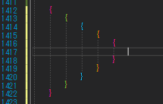
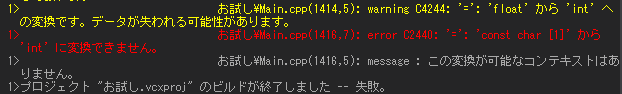

<!-- TOC -->

- [1. VisualStudioの便利機能](#1-visualstudioの便利機能)
  - [1.1. もとからある便利な機能](#11-もとからある便利な機能)
  - [1.2. おすすめ拡張機能](#12-おすすめ拡張機能)
    - [1.2.1. Viasfora](#121-viasfora)
    - [1.2.2. Visual Studio Restart](#122-visual-studio-restart)
    - [1.2.3. Solution Error Visualizer](#123-solution-error-visualizer)
    - [1.2.4. Bettre Comment](#124-bettre-comment)
    - [1.2.5. Trailling Whitespace Visualizer](#125-trailling-whitespace-visualizer)
    - [1.2.6. Filelcone](#126-filelcone)
    - [1.2.7. Output enhancer](#127-output-enhancer)
    - [1.2.8. IndentRainbow](#128-indentrainbow)
    - [1.2.9. Add new File](#129-add-new-file)
  - [1.2. ショートカットキー](#12-ショートカットキー)
  - [1.3. タスク一覧の使用](#13-タスク一覧の使用)
  - [1.4. コードスニペット](#14-コードスニペット)
    - [1.4.1. コードスニペットの作成方法](#141-コードスニペットの作成方法)
  - [1.2. 参考文献](#12-参考文献)

<!-- /TOC -->

# 1. VisualStudioの便利機能

## 1.1. もとからある便利な機能

- IDEの配色を変更する
  - ツール>オプション>環境>配色テーマ>濃色
- スペースを表示する（半角、全角区別）
  -  編集>詳細>スペースの表示

## 1.2. おすすめ拡張機能

|拡張機能名|機能|
|---|---|
|[Viasfora](#121-viasfora)|カッコに色がつく|
|[Visual Studio Restart](#122-visual-studio-restart)|Visual Studioをリスタートできる|
|[Solution Error Visualizer](#123-solution-error-visualizer) |エラーが出た際にソリューションエクスプローラに明示|
|[Bettre Comment](#124-bettre-comment)|TODO等タスクを目立たせる|
|[Trailling Whitespace Visualizer](#125-trailling-whitespace-visualizer)|行の末尾の空白を強調する|
|[Filelcone](#126-filelcone)|ソリューションエクスプローラー上のアイコン変更|
|[Output enhancer](#127-output-enhancer)|出力ウィンドウのエラーと警告に色を付ける|
|[IndentRainbow](#128-indentrainbow)|インデントの深さを色分け|
|[Add New File](#129-add-new-file)|shift+f2でクラス追加|


### 1.2.1. Viasfora



### 1.2.2. Visual Studio Restart


- タスクバーのファイル（F）にコマンドがある

### 1.2.3. Solution Error Visualizer


### 1.2.4. Bettre Comment


### 1.2.5. Trailling Whitespace Visualizer


### 1.2.6. Filelcone


### 1.2.7. Output enhancer




### 1.2.8. IndentRainbow


### 1.2.9. Add new File


## 1.2. ショートカットキー

|ショートカット|機能|
|---|---|
|ctr+alt+L|ソリューションエクスプローラー表示|
|shift+F10|右クリック|
|ctr+ →|次の単語に移動|
|ctr+w|単語の選択|
|ctr+-|直前に参照した行に移動|
|ctr+shift+-|直後に参照した行に移動|
|ctr+,|移動|
|ctr+f|単語検索|
|end|行の最後に移動|
|行の先頭に移動|home|
|行番号で移動|ctr+g|
|フォーマット|ctr+k+d|
|ファイルを閉じる|Ctrl+F4|
|すべてのタブを閉じる|Alt+W+L|
|rename|ctr+r+r|
|マルチカーソル|shift+ALT+↓|
|コメント|ctr+k+c|
|コメント解除|ctr+k+u|
|定義に移動|F12|
|呼び出し元を検索|Shift+F12|
|コード保管|Ctrl+space|
|すべてのテストを実行|ctr+r,a|
|タスク一覧の表示|ctr+\,t|

## 1.3. タスク一覧の使用

|コマンド|内容|
|---|---|
|TODO|未実装|
|HACK|要改変|
|UNDONE|作業中|
|UnresolvedMergeConflict|マージできていない|

```cs
//TODO お金を認識する
```

- タスク一覧表示のショートカットから、表示できる
- タスクを追加する
  - ツール→オプション
  - 環境→タスク一覧

## 1.4. コードスニペット

- 開くのはctr+k+x

|ショートカット|機能|
|---|---|
|prop|フィールド|
|ctor|コンストラクタ|

### 1.4.1. コードスニペットの作成方法

[スニペット作成方法](http://tools.unitycoder.com/VisualStudioSnippetsGenerator/)

上記のサイトでコードスニペットを作成し、visualstudioのツール、コードスニペットマネージャーに登録する。

## 1.2. 参考文献

[visualstudioリファレンス](https://docs.microsoft.com/ja-jp/visualstudio/ide/using-the-task-list?view=vs-2019)